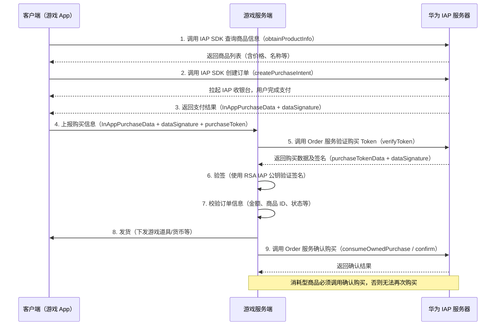
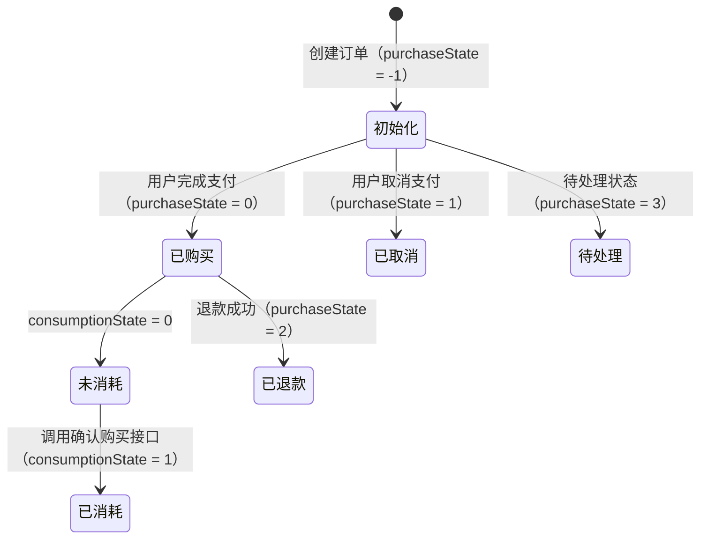

# 华为 IAP 内购项支付流程

> 本文档仅涉及**内购项（一次性商品）**的支付流程，包括消耗型商品和非消耗型商品，不涉及自动订阅。

## 目录

1. [游戏支付流程类型](#游戏支付流程类型)
2. [商品配置](#商品配置)
3. [支付流程图](#支付流程图)
4. [服务端 API 文档](#服务端-api-文档)
5. [资损相关字段](#资损相关字段)

---

## 游戏支付流程类型

### 主动查询

华为 IAP **提供订单主动查询接口**，服务端可主动调用以下接口进行订单核查：

- **Order 服务验证购买 Token**（`/applications/purchases/tokens/verify`）：验证客户端支付结果中的购买令牌，确认支付结果的准确性。该接口只针对非订阅型商品（消耗型和非消耗型）。
- **应用购买记录相关支付订单查询**（`/applications/v1/merchantQuery`）：查询指定时间范围内购买记录相关的付款和退款订单，适用于对账。

### 被动回调

华为 IAP **提供关键事件通知机制**，但**内购项（一次性商品）本身没有独立的支付成功通知回调**：

- 华为 IAP 的服务端通知（`关键事件通知 v1/v2`）主要面向**订阅型商品**，通知订阅状态变化（如首次购买、续期、取消等）。
- 对于**消耗型/非消耗型商品**，华为采用"客户端获取购买结果 → 服务端验签"的方式，无专门的支付成功回调推送到服务器。
- 推荐流程：客户端调用 IAP SDK 完成支付 → 客户端获取 `InAppPurchaseData` 和 `dataSignature` → 服务端调用 `verifyToken` 接口验签和核查 → 发货 → 调用确认购买接口。

---

## 商品配置

### 是否需要在华为后台配置商品

**是**，需要在 AppGallery Connect（华为开发者平台）中配置商品信息：

- 登录 [AppGallery Connect](https://developer.huawei.com/consumer/cn/service/josp/agc/index.html)，进入「我的应用」→「运营」→「产品运营」→「商品管理」。
- 需要配置并激活商品后，客户端才能拉取到商品信息并发起购买。

### 商品 ID

- 每种商品必须有**唯一的商品 ID**（`productId`），由开发者在 AppGallery Connect 中配置。
- 商品 ID 来源于 AppGallery Connect 中配置商品信息时设置的值。

### 币种与地区定价

- 定价货币的币种遵循 **ISO 4217 标准**（如 `CNY`、`USD`）。
- 华为 IAP 支持根据用户帐号服务地所在国家/地区，自动展示本地化语言和货币价格。
- 开发者只需在后台配置一套商品定价，华为 IAP 可自动按地区展示对应货币价格。

### 优惠配置

- 华为商品管理支持**营销活动配置**（如限时折扣、优惠券等），通过「管理商品营销」功能配置。
- 支付数据中会包含 `couponAmt`（优惠券金额）字段，记录优惠抵扣金额。
- 支持积分抵扣（`mpAmt`）。

---

## 支付流程图

### 客户端、游戏服务端、华为服务器交互流程



### 订单状态流转图



---

## 服务端 API 文档

### 接口列表

| 接口名称 | URL | 方法 | 功能说明 |
|---------|-----|------|---------|
| Order 服务验证购买 Token | `{rootUrl}/applications/purchases/tokens/verify` | HTTPS POST | 向华为 IAP 服务器校验支付结果中的购买令牌，确认支付结果准确性。仅针对非订阅型商品。 |
| Order 服务确认购买 | `{rootUrl}/applications/v2/purchases/confirm` | HTTPS POST | 消耗型商品发货成功后，通知华为 IAP 服务器更新商品发货状态（消耗确认）。若不调用，将无法再次购买该商品。 |
| 应用购买记录相关支付订单查询 | `{rootUrl}/applications/v1/merchantQuery` | HTTPS POST | 查询指定时间范围内（最多 48 小时）购买记录相关的付款和退款订单，用于对账。 |

> `rootUrl` 在不同站点有不同的值，请参考华为文档中的「站点信息和站点选择」。

---

### 1. Order 服务验证购买 Token

**接口 URL**：`{rootUrl}/applications/purchases/tokens/verify`

**说明**：向华为应用内支付服务器校验支付结果中的购买令牌，确认支付结果的准确性。只针对非订阅型商品（消耗型和非消耗型）。建议在发货前调用该接口验证，验证一致后再发货，发货成功后再调用确认购买接口。

#### 请求参数

**Request Header**

| 参数 | 是否必选 | 类型 | 描述 |
|------|----------|------|------|
| Content-Type | 是 | String | 取值为：`application/json; charset=UTF-8` |
| Authorization | 是 | String | 认证信息，使用 Access Token 进行鉴权。格式：`Basic {Base64(AT:{AccessToken})}` |
| HW-IAP-APPINFO | 否 | String | 扩展信息，支持传递签名算法 |

**Request Body**

| 参数 | 是否必选 | 类型 | 描述 |
|------|----------|------|------|
| purchaseToken | 是 | String | 待验证的购买 Token，唯一标识商品和用户的对应关系 |
| productId | 是 | String | 待下发商品 ID，来源于 AppGallery Connect 中配置的商品 ID |

#### 响应参数

**Response Body**

| 参数 | 是否必选 | 类型 | 描述 |
|------|----------|------|------|
| responseCode | 是 | String | 返回码。`0`：成功；其他：失败 |
| responseMessage | 否 | String | 响应描述 |
| purchaseTokenData | 否 | String | 包含购买数据的 JSON 字符串（InAppPurchaseData），该字段原样参与签名 |
| dataSignature | 否 | String | purchaseTokenData 基于应用 RSA IAP 私钥的签名信息，应用需使用 IAP 公钥验签 |
| signatureAlgorithm | 是 | String | 签名算法（如 `SHA256WithRSA`） |

#### 请求示例

```http
POST /applications/purchases/tokens/verify
Content-Type: application/json; charset=UTF-8
Authorization: Basic QVQ6Q1Yz...

{
  "purchaseToken": "00000173741056a37eef310dff9c6a86...",
  "productId": "prd1"
}
```

#### 响应示例

```json
{
  "responseCode": "0",
  "purchaseTokenData": "{\"autoRenewing\":false,\"orderId\":\"202008172303339595b1212421.123456\",\"packageName\":\"com.huawei.packagename\",\"applicationId\":123456,\"kind\":0,\"productId\":\"3\",\"productName\":\"商品名称\",\"purchaseTime\":1597676623000,\"purchaseTimeMillis\":1597676623000,\"purchaseState\":0,\"developerPayload\":\"payload data\",\"purchaseToken\":\"00000173741056a37...\",\"consumptionState\":0,\"confirmed\":0,\"currency\":\"CNY\",\"price\":\"100\",\"country\":\"CN\",\"payOrderId\":\"WX123456789ce8e23ee927\",\"payType\":\"17\"}",
  "dataSignature": "FiJJZYRdVIFgEzDA...",
  "signatureAlgorithm": "SHA256WithRSA"
}
```

---

### 2. Order 服务确认购买

**接口 URL**：`{rootUrl}/applications/v2/purchases/confirm`

**说明**：对于消耗型商品，发货成功后需调用此接口通知华为 IAP 服务器更新商品发货状态。若不调用，将导致用户无法再次购买该商品。等同于客户端的 `IapClient.consumeOwnedPurchase` 接口。

#### 请求参数

**Request Header**

| 参数 | 是否必选 | 类型 | 描述 |
|------|----------|------|------|
| Content-Type | 是 | String | 取值为：`application/json; charset=UTF-8` |
| Authorization | 是 | String | 认证信息，使用 Access Token 进行鉴权 |

**Request Body**

| 参数 | 是否必选 | 类型 | 描述 |
|------|----------|------|------|
| purchaseToken | 是 | String | 商品的购买 Token |
| productId | 是 | String | 商品 ID |

#### 响应参数

**Response Body**

| 参数 | 是否必选 | 类型 | 描述 |
|------|----------|------|------|
| responseCode | 是 | String | 返回码。`0`：成功；其他：失败 |
| responseMessage | 否 | String | 响应描述 |

#### 请求示例

```http
POST /applications/v2/purchases/confirm
Content-Type: application/json; charset=UTF-8
Authorization: Basic QVQ6Q1Yz...

{
  "purchaseToken": "00000173741056a37eef310dff9c6a86...",
  "productId": "prd1"
}
```

#### 响应示例

```json
{
  "responseCode": "0",
  "responseMessage": "consume success"
}
```

---

### 3. 应用购买记录相关支付订单查询

**接口 URL**：`{rootUrl}/applications/v1/merchantQuery`

**说明**：查询指定时间范围内购买记录相关的付款和退款订单。由于当天实时订单信息仍有可能变化，建议延迟一天查询（时间跨度不超过 48 小时）。

#### 请求参数

**Request Header**

| 参数 | 是否必选 | 类型 | 描述 |
|------|----------|------|------|
| Content-Type | 是 | String | 取值为：`application/json; charset=UTF-8` |
| Authorization | 是 | String | 认证信息，使用 Access Token 进行鉴权 |

**Request Body**

| 参数 | 是否必选 | 类型 | 描述 |
|------|----------|------|------|
| startAt | 是 | Long | 查询开始时间，UTC 时间戳（毫秒）。支付时间大于此时间的订单才会被查询出来 |
| endAt | 是 | Long | 查询结束时间，UTC 时间戳（毫秒）。endAt 与 startAt 时间差为 48 小时以内，且 endAt > startAt |
| continuationToken | 否 | String | 上次查询返回的分页 token，用于查询下一页数据 |

#### 响应参数

**Response Body**

| 参数 | 是否必选 | 类型 | 描述 |
|------|----------|------|------|
| responseCode | 是 | String | 返回码。`0`：成功；其他：失败 |
| responseMessage | 否 | String | 响应描述 |
| orderInfoList | 否 | JSONArray | 订单信息列表，每个 JSONObject 为一个订单 |
| continuationToken | 否 | String | 下一页数据的分页 token |

**OrderInfo 字段**

| 参数 | 是否必选 | 类型 | 描述 |
|------|----------|------|------|
| orderNo | 是 | String | 华为订单号 |
| requestId | 是 | String | 商户请求号 |
| country | 是 | String | 国家/地区码（ISO 3166） |
| merchantId | 是 | String | 商户 ID |
| applicationId | 是 | String | 应用 ID |
| orderTime | 是 | Long | 下单时间，UTC 时间戳（毫秒） |
| tradeTime | 是 | Long | 支付时间，UTC 时间戳（毫秒） |
| productId | 是 | String | 商品 SKU |
| productName | 是 | String | 商品名称 |
| payMoney | 是 | String | 支付金额，单位元 |
| couponAmt | 否 | String | 优惠券金额，单位元 |
| mpAmt | 否 | String | 积分抵扣金额，单位元 |
| mpRfdAmt | 否 | String | 积分退款金额，单位元 |
| currency | 是 | String | 币种（ISO 4217，如 CNY） |
| payType | 是 | Integer | 支付方式 |
| tradeState | 是 | Integer | 订单状态：`0`=成功，`2`=失败，`4`=未支付 |
| tradeType | 是 | String | 交易类型：`PURCHASE`=支付，`REFUND`=退款 |
| oriOrderNo | 否 | String | 原始华为订单号（退款时返回） |
| refundTime | 否 | Long | 退款时间，UTC 时间戳（毫秒） |
| refundMoney | 否 | String | 退款金额，单位元 |

#### 请求示例

```http
POST /applications/v1/merchantQuery
Content-Type: application/json; charset=UTF-8
Authorization: Basic QVQ6Q1Yz...

{
  "startAt": 1666800000000,
  "endAt": 1666886400000
}
```

---

## 资损相关字段

资损防控需要重点关注以下字段，所有字段均来源于 `InAppPurchaseData` 或订单查询接口的响应数据。

### 金额信息字段

| 字段 | 来源 | 类型 | 描述 |
|------|------|------|------|
| price | InAppPurchaseData | Long | 商品实际价格 × 100（精确到小数点后 2 位）。如值为 `501` 表示价格为 5.01。**验签后必须校验，避免资损** |
| currency | InAppPurchaseData | String | 定价货币币种（ISO 4217，如 `CNY`）。**验签后必须校验** |
| payMoney | OrderInfo（查询接口） | String | 支付金额（单位元），如 `10.00` |
| couponAmt | OrderInfo（查询接口） | String | 优惠券金额（单位元） |
| mpAmt | OrderInfo（查询接口） | String | 积分抵扣金额（单位元） |
| refundMoney | OrderInfo（查询接口） | String | 退款金额（单位元） |

### 购买者账号字段

| 字段 | 来源 | 类型 | 描述 |
|------|------|------|------|
| applicationId | InAppPurchaseData | Long | 应用 ID，用于确认购买所属应用。**验签后必须校验** |
| packageName | InAppPurchaseData | String | 应用包名 |
| accountFlag | InAppPurchaseData | Integer | 账户类型：`1`=华为帐号，`0`=AppTouch 账户 |
| merchantId | OrderInfo（查询接口） | String | 商户 ID |

### 订单状态字段

| 字段 | 来源 | 类型 | 描述 |
|------|------|------|------|
| purchaseState | InAppPurchaseData | Integer | 购买状态：`0`=成功，`1`=已取消，`2`=已退款，`3`=待处理（延迟付款） |
| consumptionState | InAppPurchaseData | Integer | 消耗状态：`0`=未消耗，`1`=已消耗 |
| tradeState | OrderInfo（查询接口） | Integer | 交易状态：`0`=成功，`2`=失败，`4`=未支付 |
| tradeType | OrderInfo（查询接口） | String | 交易类型：`PURCHASE`=支付，`REFUND`=退款 |

### 发货商品字段

| 字段 | 来源 | 类型 | 描述 |
|------|------|------|------|
| productId | InAppPurchaseData | String | 商品 ID。**验签后必须校验，与服务器本地商品 ID 对比** |
| productName | InAppPurchaseData | String | 商品名称 |
| kind | InAppPurchaseData | Integer | 商品类型：`0`=消耗型，`1`=非消耗型，`2`=订阅型 |
| purchaseToken | InAppPurchaseData | String | 购买令牌，唯一标识一笔购买，用于发货和确认购买。**务必防止重复发货（幂等校验）** |
| orderId | InAppPurchaseData | String | 华为订单 ID |
| developerPayload | InAppPurchaseData | String | 开发者在发起购买时透传的自定义信息，用于关联自有订单 |
| purchaseTime | InAppPurchaseData | Long | 购买时间，UTC 时间戳（毫秒） |
